# NDM-Wise Outstanding Report Automation

## Overview
This project automates the generation of **National District Manager (NDM)-wise outstanding reports** using Python. It transforms raw financial/operational data into structured reports for tracking credit outstanding, aging analysis, and branch performance.

## Business Problem
Manual reporting of outstanding balances and aging analysis is time-consuming and error-prone.  
This project solves that by:
- Automating report generation
- Standardizing KPI calculations
- Providing clear insights into credit and operational performance

## Key Features
- NDM-wise credit outstanding analysis
- Matured & non-matured credit aging
- Branch-level performance tracking
- Cash drop aging analysis
- Top-performing branches and delivery personnel identification
- Automated CSV report generation

## Tools & Technologies
- Python (Pandas, NumPy)
- Data Cleaning & Transformation
- CSV Report Generation
- KPI Calculation

## Project Structure
- `Generate_all_csv.py` – Generates report outputs
- `generate_all_kpi.py` – Calculates KPIs
- `branch_wise_cash_drop_aging.csv` – Sample output
- `Images/` – Visual report outputs

---

## Sample Outputs

### Dashboard Summary
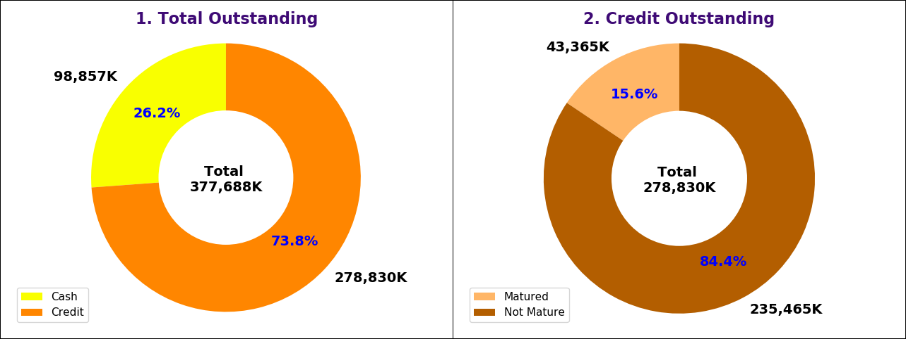

### NDM Credit Outstanding
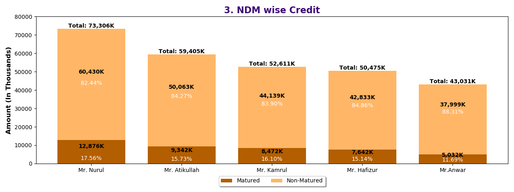

### Matured Credit Aging

### NDM Matured Credit Aging
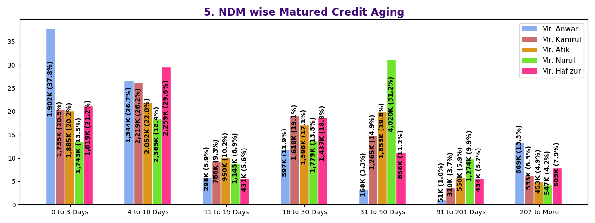

### Branch-Wise Matured Credit Aging
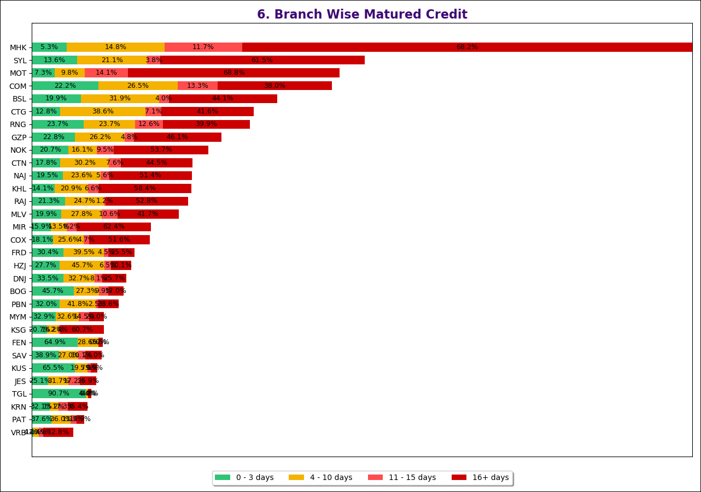

### Non-Matured Credit Aging
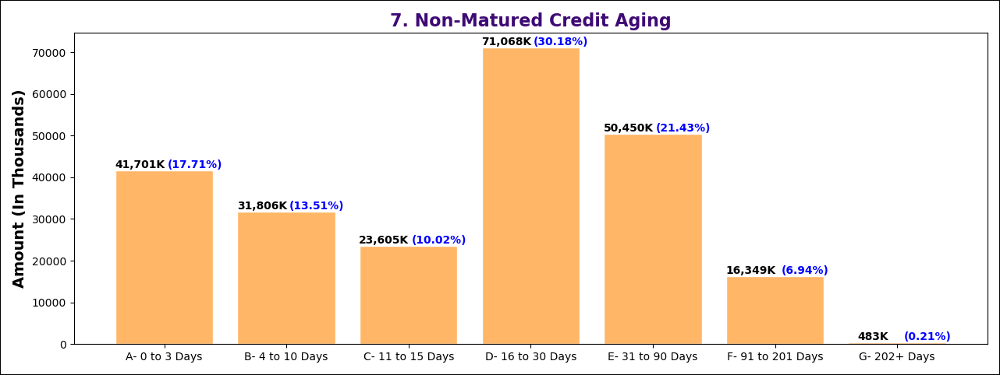

### NDM Non-Matured Credit Aging
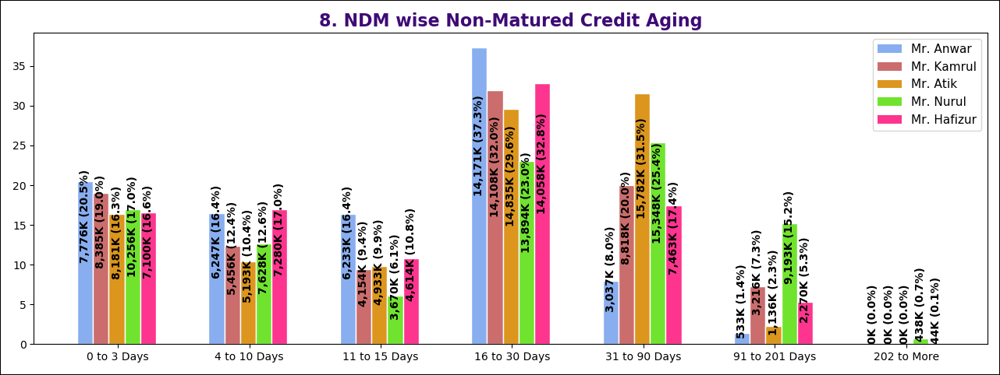

### Branch Non-Matured Analysis
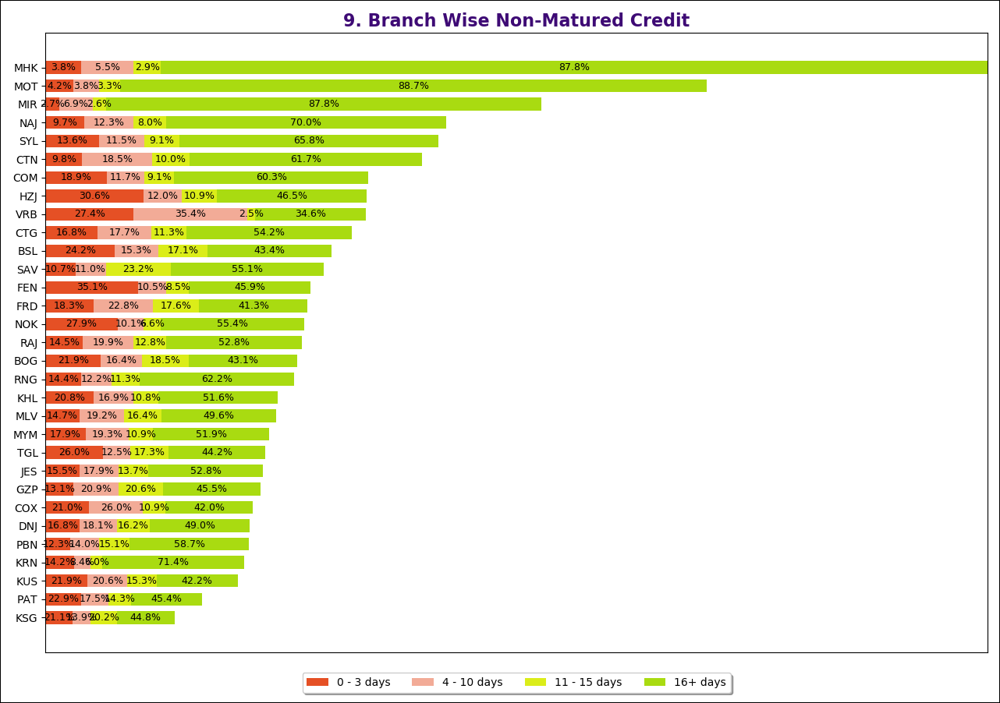

### Cash Drop Aging
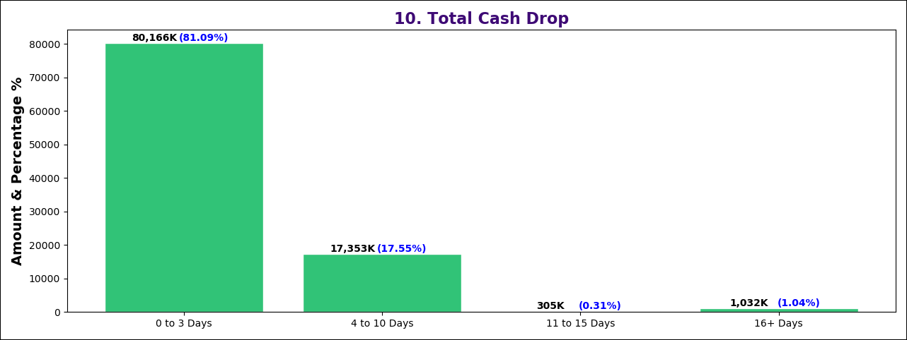

### NDM Cash Drop Aging
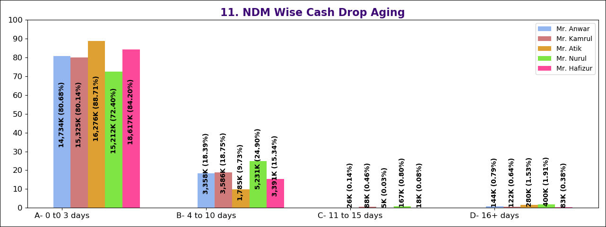

### Branch Cash Drop Aging
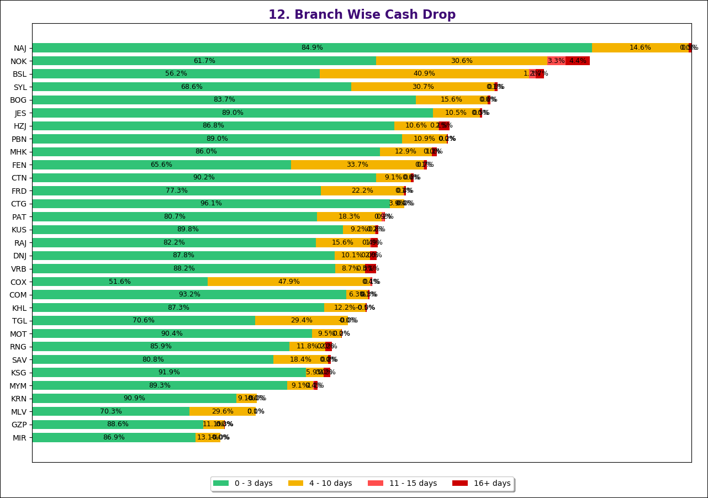

### Return Summary
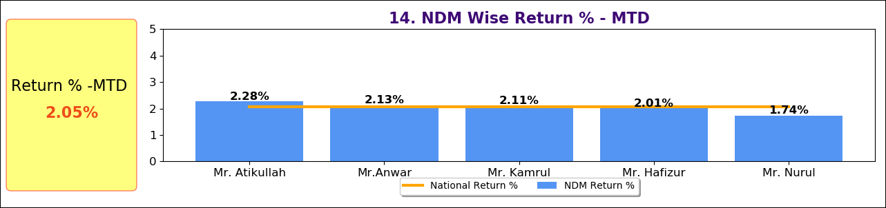

### Top 5 Branch Return
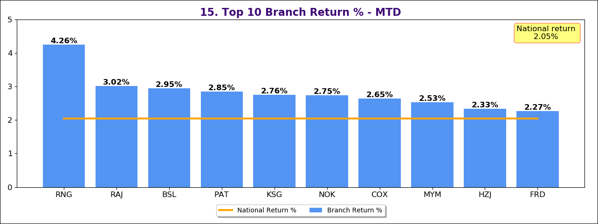

### Top 5 Delivery Performance
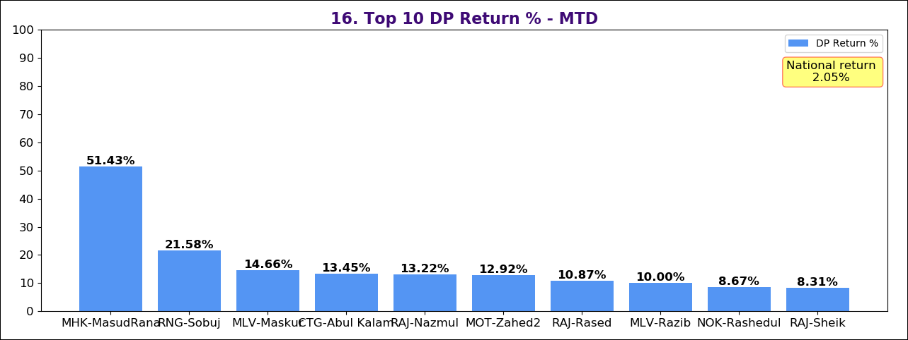

---

## Skills Demonstrated
- Data Analysis & Reporting
- Python Automation
- Business KPI Development
- Data Visualization (via reports)
- Financial/Operational Data Analysis

---

## Future Improvements
- Convert reports into interactive dashboard (Power BI/Tableau)
- Add automated data pipeline
- Deploy as a reporting tool or web app
